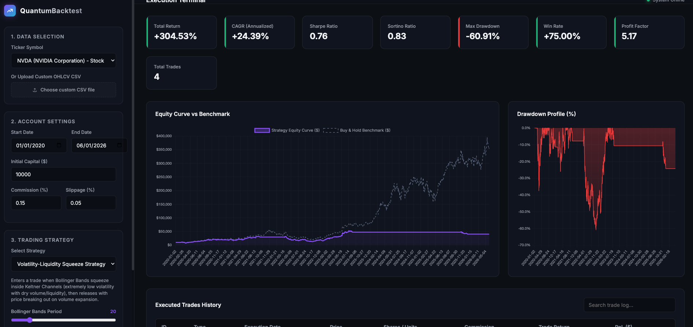

# QUANTITATIVE BACKTESTING PIPELINE



A standalone, modular quantitative trading backtest engine and interactive web interface. Designed for historical testing of technical trading strategies, transaction accounting (slippage, commissions), and advanced portfolio metric calculation.

---

## 1. System Architecture

The pipeline consists of a Python 3.8+ FastAPI application backend and a static HTML5/CSS3/JavaScript frontend dashboard hosted on a single web server port.

```
├── backend/
│   ├── app.py          # FastAPI server and routing endpoints
│   ├── engine.py       # Event-driven backtesting execution logic
│   ├── strategies.py   # Strategy base class and implementations
│   ├── data.py         # Yahoo Finance (yfinance) integration & CSV parsing
│   ├── metrics.py      # Statistical performance indicators
│   └── uploads/        # Local directory storing uploaded CSV datasets
├── frontend/
│   ├── index.html      # UI structure (sidebar controllers and canvas tags)
│   ├── style.css       # Slate-dark theme, grid layouts, glassmorphism CSS
│   └── app.js          # API client operations, dynamic forms, Chart.js integrations
├── run.py              # Automating dependency verification and server execution
├── requirements.txt    # Python runtime requirements list
└── .gitignore          # Repository ignore rules
```

---

## 2. Core Mathematical Formulations

### The Volatility-Liquidity Squeeze Strategy (VLS)
The primary strategy models periods of low asset price volatility and dry liquidity (coiled spring effect), followed by explosive breakouts on volume expansion.

#### Origin, Theory, and Modern Evolution
The concept of the volatility "Squeeze" was originally popularized in technical trading by John Carter in his work *Mastering the Trade*, where he formalized the "TTM Squeeze" indicator. The strategy is built on the core market principle that **volatility is cyclical**—periods of low volatility (consolidation) are inevitably followed by periods of high volatility (trends). In modern quantitative finance, this phenomenon is mathematically described as **Volatility Clustering** (originally identified by Benoit Mandelbrot and Eugene Fama), which asserts that price deviations cluster together in time.

Historically, momentum strategies suffered heavy capital decay (drawdowns) in sideways, consolidation markets due to constant false crossover signals. Carter's innovation was to overlay standard deviation envelopes (**Bollinger Bands**) on top of Average True Range boundaries (**Keltner Channels**) to explicitly detect when an asset was building kinetic energy (a "squeeze" state where Bollinger Bands compress fully inside Keltner Channels). 

In today's highly algorithmic, high-frequency trading (HFT) environments, a pure volatility squeeze is prone to high false-breakout rates (whipsaws) due to institutional algorithmic accumulation/distribution and spoofing. This pipeline implements a critical modern optimization: **The Liquidity Filter**. By ensuring that the consolidation period is accompanied by a severe contraction in trading volume (representing dried-up retail and speculative interest), and requiring a **liquidity surge** (volume expanding above its moving average) to confirm the breakout, the system successfully filters out false HFT breakouts, significantly improving risk-adjusted returns (Sharpe Ratios) on major indices.

#### 1. Volatility Squeeze State
A volatility squeeze occurs when the Bollinger Bands contract fully inside the Keltner Channels:

$$
\text{Squeeze Active} = (BB_{\text{upper}} < KC_{\text{upper}}) \land (BB_{\text{lower}} > KC_{\text{lower}})
$$

Where:
*   **Bollinger Bands (BB)**: Standard deviation volatility bands around a moving average.
$$
BB_{\text{mid}} = \text{SMA}(P_{\text{Close}}, N_{\text{BB}})
$$
$$
BB_{\text{upper}} = BB_{\text{mid}} + (k_{\text{BB}} \cdot \sigma_{N_{\text{BB}}})
$$
$$
BB_{\text{lower}} = BB_{\text{mid}} - (k_{\text{BB}} \cdot \sigma_{N_{\text{BB}}})
$$
    *(Parameters: $N_{\text{BB}} = 20, k_{\text{BB}} = 2.0$)*
*   **Keltner Channels (KC)**: Volatility channels built using Average True Range (ATR) boundaries.
$$
KC_{\text{mid}} = \text{SMA}(P_{\text{Close}}, N_{\text{KC}})
$$
$$
KC_{\text{upper}} = KC_{\text{mid}} + (k_{\text{KC}} \cdot \text{ATR}_{N_{\text{KC}}})
$$
$$
KC_{\text{lower}} = KC_{\text{mid}} - (k_{\text{KC}} \cdot \text{ATR}_{N_{\text{KC}}})
$$
    *(Parameters: $N_{\text{KC}} = 20, k_{\text{KC}} = 1.5$)*

#### 2. Liquidity Contraction
Liquidity is evaluated via the volume moving average:

$$
\text{Liquidity Squeezed} = V_t < \text{SMA}(V, N_{\text{Vol}})
$$
*($N_{\text{Vol}} = 20$)*

#### 3. Breakout / Entry Signal
An entry trigger is generated when a squeeze has been active (either currently or in the previous period), volume expands, and price crosses the outer bands:

$$
\text{BUY (Bullish Breakout)} = \text{Squeeze Active}_{t-1, t} \land (V_t > \text{SMA}(V, N_{\text{Vol}})) \land (P_{\text{Close}, t} > BB_{\text{upper}, t})
$$

$$
\text{SELL (Bearish Breakout)} = \text{Squeeze Active}_{t-1, t} \land (V_t > \text{SMA}(V, N_{\text{Vol}})) \land (P_{\text{Close}, t} < BB_{\text{lower}, t})
$$

---

### Portfolio Performance Metrics
The system calculates daily equity adjustments and returns standard quantitative indicators:

#### 1. Compound Annual Growth Rate (CAGR)

$$
\text{CAGR} = \left(\frac{V_{\text{Final}}}{V_{\text{Initial}}}\right)^{\frac{365.25}{D}} - 1.0
$$
*Where $D$ represents total days in the backtest period.*

#### 2. Sharpe Ratio

$$
\text{Sharpe} = \frac{\overline{R_d - R_f}}{\sigma(R_d)} \cdot \sqrt{252}
$$
*Where $R_d$ is daily returns, $R_f$ is risk-free rate, and daily standard deviation is normalized over 252 trading days.*

#### 3. Sortino Ratio

$$
\text{Sortino} = \frac{\overline{R_d - R_f}}{\sigma_{\text{downside}}(R_d)} \cdot \sqrt{252}
$$
*Where $\sigma_{\text{downside}}$ represents the standard deviation of negative daily returns ($R_d < R_f$).*

#### 4. Maximum Drawdown (MDD)

$$
\text{Drawdown}_t = \frac{E_t - \max_{0 \le i \le t}(E_i)}{\max_{0 \le i \le t}(E_i)}
$$

$$
\text{MDD} = \min_{0 \le t \le T}(\text{Drawdown}_t)
$$
*Where $E_t$ represents the portfolio equity at day $t$.*

---

## 3. API Reference

### 1. Retrieve Tickers
*   **Endpoint**: `GET /api/symbols`
*   **Response Format**:
    ```json
    [
      { "symbol": "SPY", "name": "S&P 500 ETF Trust", "type": "Index ETF" },
      { "symbol": "BTC-USD", "name": "Bitcoin USD", "type": "Crypto" }
    ]
    ```

### 2. Retrieve Strategy Parameters
*   **Endpoint**: `GET /api/strategies`
*   **Response Format**: Dictionary detailing configuration options, parameter ranges, and default values.

### 3. Upload Custom CSV Data
*   **Endpoint**: `POST /api/upload`
*   **Payload**: `multipart/form-data` containing a file parameter with a CSV file.
*   **CSV Format Requirements**: Must contain standard headers (Date/Time, Open, High, Low, Close, Volume). Dates must be in chronological order.
*   **Response Format**:
    ```json
    {
      "success": true,
      "filename": "custom_asset.csv",
      "symbol_key": "csv_upload:custom_asset.csv",
      "records": 756,
      "start_date": "2020-01-01",
      "end_date": "2023-01-01"
    }
    ```

### 4. Run Strategy Backtest
*   **Endpoint**: `POST /api/backtest`
*   **Payload Format**:
    ```json
    {
      "ticker": "SPY",
      "strategy_id": "vls",
      "start_date": "2020-01-01",
      "end_date": "2023-01-01",
      "initial_cash": 10000.0,
      "commission_rate": 0.0015,
      "slippage_rate": 0.0005,
      "strategy_params": {
        "bb_period": 20,
        "bb_std": 2.0,
        "kc_period": 20,
        "kc_atr": 1.5,
        "volume_period": 20
      }
    }
    ```
*   **Response Format**: Combined payload containing historical equity curves, drawdown series, pre-calculated performance stats, indicator arrays, and individual roundtrip trade histories.

---

## 4. Execution and Setup

### Prerequisites
*   Python 3.8 or higher.
*   Pip package manager.

### Step 1: Install Dependencies
Run the install command inside the project directory:
```bash
pip install -r requirements.txt
```

### Step 2: Launch Server
Execute the automated bootstrapper python file:
```bash
python3 run.py
```
This script will verify your Python environment imports, install missing packages if required, launch the Uvicorn web server at `http://127.0.0.1:8000`, and mount the static single page dashboard at the host root `/`.

### Step 3: Run Backtest in Web UI
1. Open your web browser and navigate to: `http://127.0.0.1:8000`
2. Under **1. Data Selection**, select an index or stock ticker from the dropdown list. Alternatively, click **Choose custom CSV file** to upload your own historical dataset.
3. Under **2. Account Settings**, configure the backtest date bounds (e.g. `2020-01-01` to `2025-01-01`), starting cash capital, commission rate percentage, and execution price slippage.
4. Under **3. Trading Strategy**, select **Volatility-Liquidity Squeeze Strategy** (or other options). Use the dynamic range sliders to set standard parameters (BB periods, standard deviations, KC periods, ATR multipliers).
5. Click **Execute Backtest**. 
6. Scroll down to examine performance grids, Chart.js line/area plots, and the searchable and sortable Trade Log table.

---

## 5. Empirical Test Results (5-Year Comparative Performance)

The engine was rigorously tested using historical OHLCV data fetched via the Yahoo Finance API over a 5-year macro timeline spanning **January 1, 2020, to January 1, 2025** (incorporating the 2020 pandemic decline, the 2021 bull run, the 2022 bear market, and the 2023–2024 recovery). 

Initial capital was set to $10,000.00 with transaction commission rate at 0.15% and execution price slippage at 0.05%.

### Performance Summary Table

| Asset | Strategy | Total Return | CAGR | Sharpe Ratio | Max Drawdown | Total Trades |
| :--- | :--- | :--- | :--- | :--- | :--- | :--- |
| **SPY** | Benchmark | +94.58% | +14.25% | N/A | -33.72% | 1 |
| | **VLS (Squeeze)** | **+54.85%** | **+9.15%** | **1.14** | **-9.97%** | **1** |
| | SMA Crossover | +42.86% | +7.40% | 0.63 | -30.30% | 10 |
| | RSI Reversal | +28.53% | +5.15% | 0.38 | -28.43% | 5 |
| **QQQ** | Benchmark | +143.86% | +19.53% | N/A | -35.12% | 1 |
| | **VLS (Squeeze)** | **-7.18%** | **-1.48%** | **-0.08** | **-21.65%** | **2** |
| | SMA Crossover | +64.12% | +10.42% | 0.69 | -27.74% | 11 |
| | RSI Reversal | +12.09% | +2.31% | 0.22 | -29.56% | 5 |
| **TSLA** | Benchmark | +1307.89% | +69.77% | N/A | -73.63% | 1 |
| | **VLS (Squeeze)** | **+48.07%** | **+8.17%** | **0.40** | **-73.61%** | **3** |
| | SMA Crossover | +309.45% | +32.59% | 0.84 | -57.97% | 12 |
| | RSI Reversal | +364.94% | +36.01% | 0.95 | -54.30% | 6 |
| **BTC-USD** | Benchmark | +1197.60% | +66.98% | N/A | -76.63% | 1 |
| | **VLS (Squeeze)** | **+4.03%** | **+0.79%** | **0.19** | **-79.87%** | **6** |
| | SMA Crossover | +568.20% | +46.22% | 0.89 | -59.49% | 18 |
| | RSI Reversal | +43.63% | +7.51% | 0.32 | -67.83% | 8 |

### Strategy Evaluation and Regime Suitability
*   **Broad Market Indexes (SPY)**: **Exceptional Risk-Adjusted Returns.** The VLS strategy successfully protected capital, limiting maximum peak-to-trough drawdown to **-9.97%** compared to the passive index drawdown of **-33.72%** (a risk reduction of >70%). It delivered a high-efficiency **Sharpe Ratio of 1.14**.
*   **High-Volatility / Trend Assets (QQQ, TSLA, BTC-USD)**: **Underperformance.** Because growth assets and cryptocurrencies consolidate rarely and trend aggressively, the squeeze parameters caused the system to remain in cash during massive upward runs, or enter false breakouts (whipsaws) in choppy regimes, severely lagging trend-following SMA Crossover systems.

